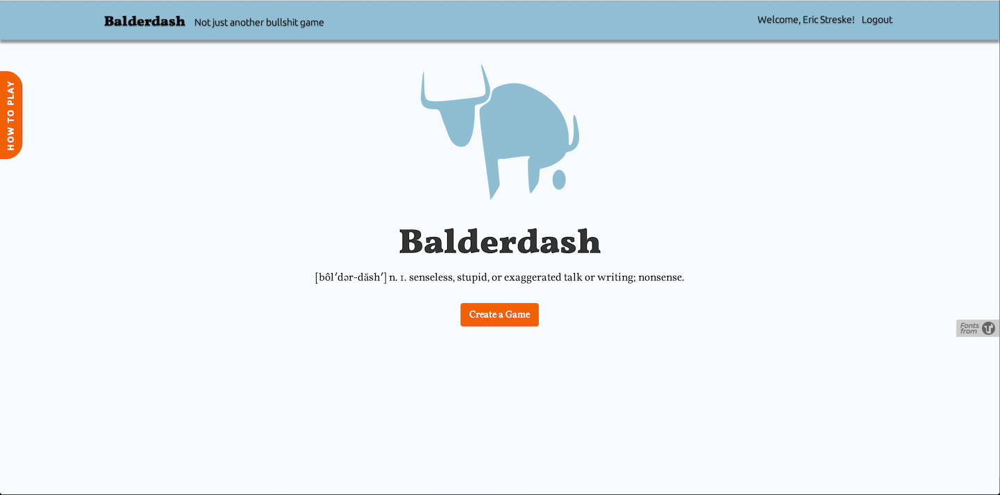

#Balderdash

Bladerdash allows users to play this classic board game with their friends on multiple browsers with real-time updates.



##Rules of the Game
1. Create a game or join someone else's.
2. The person who opened the game starts it when their friends have joined.
3. We give you a random word, make up the most believable definition you can.
4. When all definitions are submitted we will show them along with the real one.
5. Vote for the one you think is correct. No cheating!
6. You get a point for every vote your definition gets and two points for guessing the correct    definition
7. Whoever has the most points after seven rounds wins!

##Gems and APIs Used

- Nokogiri
- Font-Awesome


##Code Snippets
This is the Javascript code used to check whether all players in the game have submitted thier picks for definition.  

```
function RoundView(){
  this.setSync();
}

RoundView.prototype = {
  
  sync: function(){
    var pathName = window.location.pathname;
    var self = this;
    $.ajax({
      url: "/games/" + pathName.split("/")[2]+ '/picks',
      dataType: 'json',
      method: 'get',
      success: function(data){
        if (data.status === 'all_picked'){
          clearInterval(self.interval); 
          location.reload();
        }
      }
    })
  },

  setSync: function(){
    var self = this;
    this.interval = setInterval(function(){self.sync()},1000);
  },
};
```

##Contact

For any additional information or suggestions, please contact Eric Streske at estreske@gmail.com. 